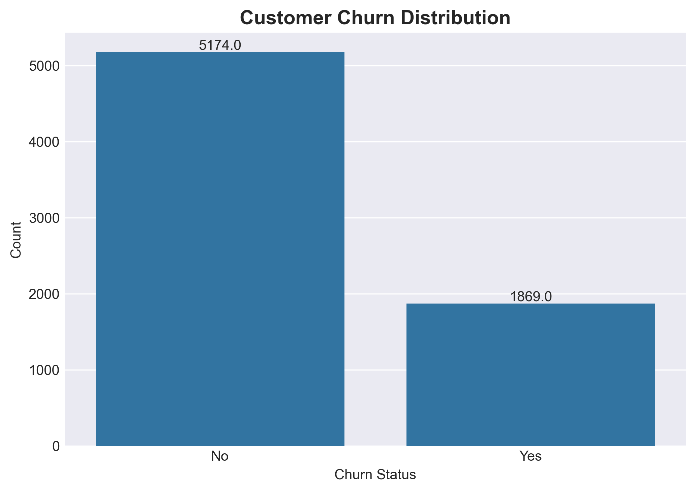
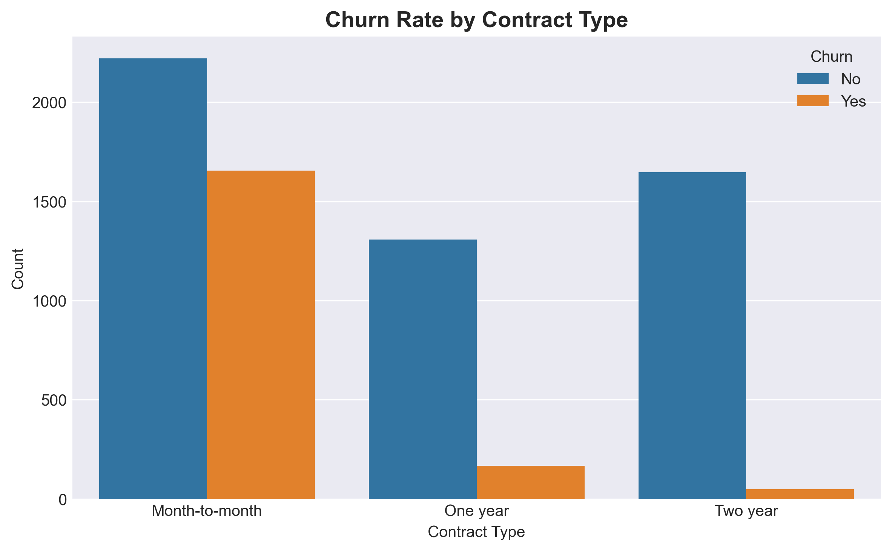

# Customer Churn Prediction for Telecom

Predicts which customers are likely to cancel their telecom subscription using machine learning. Helps companies reduce revenue loss by targeting at-risk users with retention offers.

### **Business Problem**
Customer churn costs telecom companies 5-7x more than retention. This model identifies high-risk customers before they leave.

### **Live Demo**
[Try the Churn Predictor App](https://customer-churn-predictor-cpdkapp2kpxkc2s9fkquv94.streamlit.app/)



### **Tech Stack**
**Python** | **Pandas** | **NumPy** | **Scikit-learn** | **XGBoost** | **Matplotlib** | **Seaborn** | **Streamlit**

### **Results**


- **Model:** XGBoost Classifier
- **F1-Score:** 87%
- **Accuracy:** 85%
- **Key Insight:** Customers with month-to-month contracts + fiber optic internet have 3x higher churn risk

### **Key Features Used**
1. Contract type
2. Monthly charges  
3. Tenure
4. Internet service
5. Payment method

### **Run Locally**
```bash
git clone https://github.com/adembabenedict-source/customer-churn-predictor.git
cd customer-churn-predictor
pip install -r requirements.txt
streamlit run src/app.py
